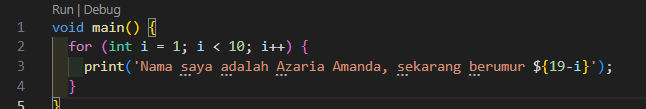
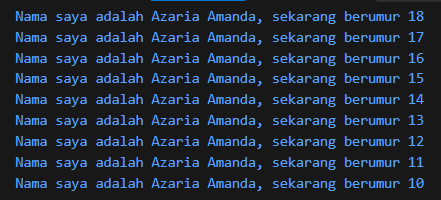
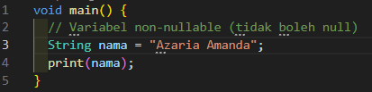
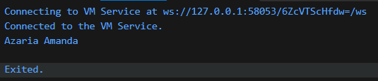
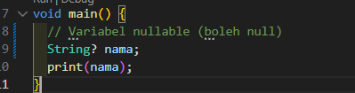
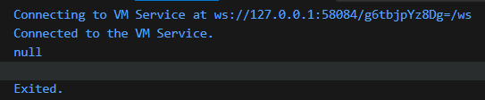

# Tugas Praktikum 02 Pengantar Bahasa Pemrograman Dart - Bagian 1

Nama    : Azaria Amanda  
NIM     : 244107060060  
Absen   : 05   

## Soal 1
Modifikasilah kode pada baris 3 di VS Code atau Editor Code favorit Anda berikut ini agar mendapatkan keluaran (output) sesuai yang diminta!  
Modifikasi kode:  
 
Output: 

## Soal 2
Mengapa sangat penting untuk memahami bahasa pemrograman Dart sebelum kita menggunakan framework Flutter ? Jelaskan!  
Jawab: 
- Karena Flutter dibuat sepenuhnya menggunakan bahasa dart, mulai dari tampilan, logika, data, hingga koneksi backend menggunakan dart. Dart juga mempunyai konsep penting seperti OOP, widget yang tidak bisa diubah (immutable), penggunaan const, atau cara menangani data yang datang belakangan (Future dan async).
- Jika langsung memakai flutter tanpa memahami dasar-dasar dart terlebih dahulu maka kita akan mengalami kesulitan mengerti alur kerjanya, susah debug error, dan cenderung hanya copy-paste.

## Soal 3
Rangkumlah materi dari codelab ini menjadi poin-poin penting yang dapat Anda gunakan untuk membantu proses pengembangan aplikasi mobile menggunakan framework Flutter. 
Jawab:  
- Dart adalah bahasa utama Flutter, sehingga semua kode aplikasi, widget, logika bisnis, dan plugin ditulis dalam Dart.
- Kode Dart bisa dikompilasi menjadi JavaScript untuk web dan native ARM/x86 untuk mobile/desktop.
- Cara kerja Dart menggunakan Dart VM dengan dua mode kompilasi, Just-In-Time (JIT) untuk pengembangan, mendukung hot reload cepat di Flutter dan Ahead-Of-Time (AOT) untuk dipakai saat build rilis, hasilkan kode native yang membuat performa aplikasi Flutter jadi cepat & ringan..
- Kode Dart dieksekusi mulai dari fungsi main().
- Dart adalah bahasa Object-Oriented (OOP) dengan konsep class, objek, method, dan fitur seperti inheritance, encapsulation, composition, abstraction dan polymorphism.
- Operator dasar yang sering dipakai ada aritmatika (+, -, *, /, ~/ untuk integer division, %, -expressio/ untuk negasi yang membalikkan suatu nilai), shortcut operator (+=, -=, *=, /=, dan ~/=), increment/decrement (++ --), equality (==, !=), relational (>, <, dll), dan logical (!expression, &&, ||).

## Soal 4
Buatlah penjelasan dan contoh eksekusi kode tentang perbedaan Null Safety dan Late variabel ! 
Jawab:  
### Null Safety
Fitur dimana secara default, variabel tidak boleh bernilai null kecuali diizinkan secara eksplisit. Terdapat 2 jenis variabel yaitu Non-nullable dan Nullable.
- Non-nullable yang artinya variabel harus memiliki nilai jika tidak maka akan menyebabkan error.
- Contoh Kode: 

- Output: 
   
- Nullable (?) artinya variabel diizinkan untuk bernilai null dengan menambahkan tanda tanya.
- Contoh Kode: 

- Output: 
  

### Late Variables
Keyword late digunakan untuk mendeklarasikan variabel non-nullable yang nilainya tidak diberikan saat deklarasi, tetapi akan diinisialisasi sebelum variabel tersebut digunakan.
Namun, jika variabel late diakses sebelum diisi, maka akan terjadi runtime error (LateInitializationError).
- Contoh Kode: 

- Output: 
   
- late dipakai sebelum diisi:
- Contoh Kode: 

- Output: 
