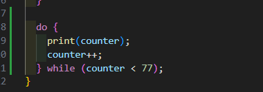
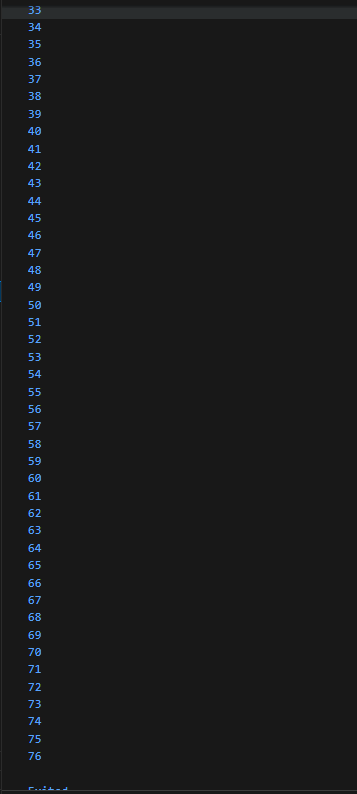
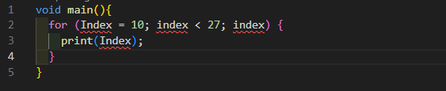
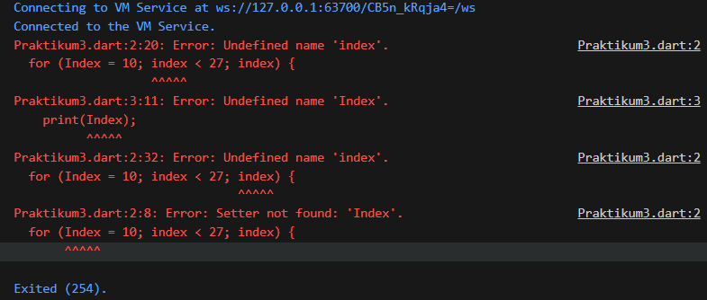
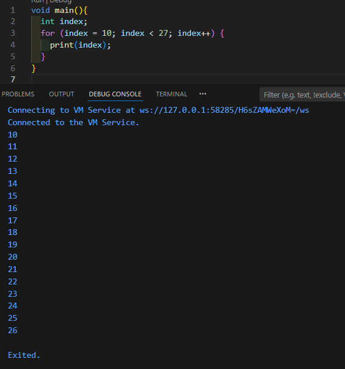
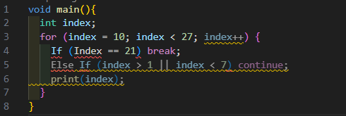
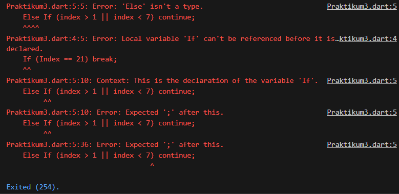
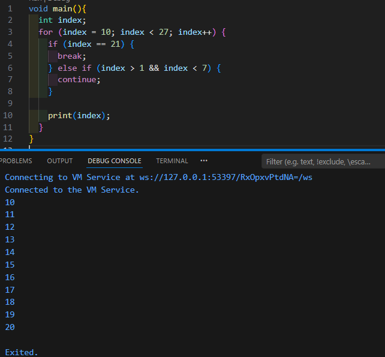
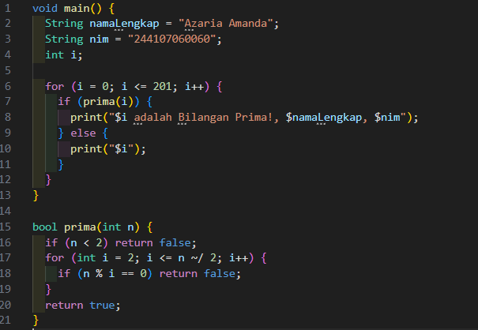
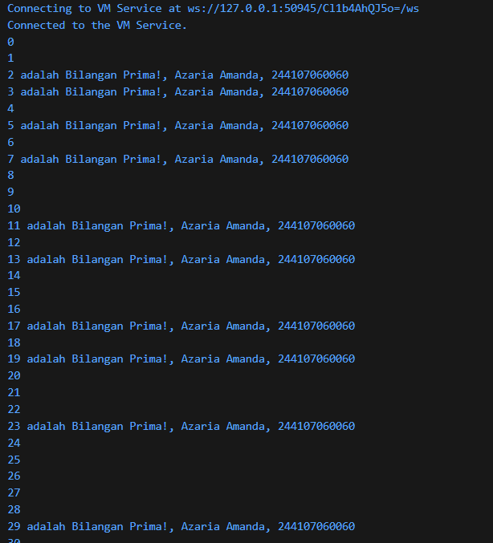

# Tugas Praktikum 03 Pengantar Bahasa Pemrograman Dart - Bagian 2

Nama    : Azaria Amanda  
NIM     : 244107060060  
Absen   : 05   

## Tugas Praktikum 1: Menerapkan Control Flows ("if/else")
1. Ketik atau salin kode program berikut ke dalam fungsi main().
- Hasil kode:  
 
2. Silakan coba eksekusi (Run) kode pada langkah 1 tersebut. Apa yang terjadi? Jelaskan!
- Output: 

- Penjelasan:  
Kode program menngalami error disebabkan oleh penulisan Else If yang menggunakan huruf kapital, seharusnya else if karena diketik dengan huruf kapital maka dart menganggap sebagai kesalahan. 
Masalah ini dapat diperbaiki dengan mengubah seluruh kata kunci tersebut menjadi huruf kecil semua, yaitu else if dan else. Setelah diperbaiki, program akan berjalan dengan normal dan memeriksa variabel test yang berisi string "test2". Hasilnya, program akan melewati kondisi pertama, lalu mencetak output "Test2" karena kondisi kedua terpenuhi, serta mencetak "Test2 again" pada pengecekan if mandiri di baris terakhir.
- Perbaikan: 

- Output: 

3. Tambahkan kode program berikut, lalu coba eksekusi (Run) kode Anda.
- Tambahan kode:  
 
Apa yang terjadi ? Jika terjadi error, silakan perbaiki namun tetap menggunakan if/else.
- Output: 

- Penjelasan:  
Kode program menngalami error disebabkan oleh variabel test yang sudah pernah dideklarasikan sebelumnya dengan nilai "test2", sehingga ketika dideklarasikan kembali dengan String test = "true"; pada bagian berikutnya, muncul error “test is already declared in this scope”. Selain itu, pada kondisi if (test) juga terjadi kesalahan karena nilai test bertipe String, sedangkan kondisi pada if harus berupa boolean (true atau false). 
Perbaikan dapat dilakukan dengan mengganti nama variabel agar tidak sama dengan variabel sebelumnya. Selain itu, kondisi if diperbaiki dengan membandingkan nilai String tersebut yaitu if (testPerbaikan == "true"). Setelah diperbaiki, program dapat dijalankan dengan benar dan akan menampilkan “Kebenaran” karena nilai variabel bernilai "true". Output akhir yang muncul adalah Test2, Test2 again, dan Kebenaran.
- Perbaikan: 

- Output: 

## Tugas Praktikum 2: Menerapkan Perulangan "while" dan "do-while"
1. Ketik atau salin kode program berikut ke dalam fungsi main().
- Hasil kode:  
 
2. Silakan coba eksekusi (Run) kode pada langkah 1 tersebut. Apa yang terjadi? Jelaskan! Lalu perbaiki jika terjadi error.
- Output: 

- Penjelasan:  
Program pada kode tersebut mengalami error saat dijalankan. Hal ini terjadi karena variabel counter digunakan pada perulangan while, tetapi belum dideklarasikan terlebih dahulu di dalam program. Akibatnya, Dart menampilkan error seperti “Undefined name 'counter'” dan “Getter not found: 'counter'”, karena sistem tidak mengetahui variabel yang dimaksud. 
Program pada kode tersebut mengalami error saat dijalankan. Hal ini terjadi karena variabel counter digunakan pada perulangan while, tetapi belum dideklarasikan terlebih dahulu di dalam program. Akibatnya, Dart menampilkan error seperti “Undefined name 'counter'” dan “Getter not found: 'counter'”, karena sistem tidak mengetahui variabel yang dimaksud.
- Perbaikan: 

3. Tambahkan kode program berikut, lalu coba eksekusi (Run) kode Anda.
- Tambahan kode:  
 
Apa yang terjadi ? Jika terjadi error, silakan perbaiki namun tetap menggunakan do-while.
- Output: 

- Penjelasan:  
Setelah kode do–while ditambahkan dan program dijalankan, program tidak mengalami error dan dapat berjalan dengan baik. Hal ini karena variabel counter sudah dideklarasikan sebelumnya dan memiliki nilai terakhir dari perulangan sebelumnya, yaitu 33. Pada perulangan do–while, perintah di dalam blok do akan dijalankan terlebih dahulu sebelum kondisi diperiksa. Oleh karena itu, program langsung mencetak nilai counter, kemudian nilai tersebut ditambah satu dengan counter++. 
Perulangan akan terus berjalan selama kondisi counter < 77 masih bernilai benar. Akibatnya, program akan menampilkan angka hingga 76 secara berurutan.

## Tugas Praktikum 3: Menerapkan Perulangan "for" dan "break-continue"
1. Ketik atau salin kode program berikut ke dalam fungsi main().
- Hasil kode:  
 
2. Silakan coba eksekusi (Run) kode pada langkah 1 tersebut. Apa yang terjadi? Jelaskan! Lalu perbaiki jika terjadi error.
- Output: 

- Penjelasan:  
Program pada kode tersebut mengalami error saat dijalankan. Hal ini terjadi karena variabel index digunakan pada perulangan for, tetapi belum dideklarasikan terlebih dahulu. Selain itu, terdapat ketidakkonsistenan penulisan antara Index dan index, padahal pada bahasa Dart penulisan huruf besar dan kecil dibedakan (case sensitive). Akibatnya, Dart tidak mengenali variabel tersebut dan menampilkan error seperti “Undefined name 'index'” dan “Undefined name 'Index'”. Selain itu, pada bagian perulangan juga belum terdapat operasi penambahan nilai variabel yang benar. 
Untuk memperbaiki kesalahan tersebut, variabel index harus dideklarasikan terlebih dahulu dengan tipe data int, kemudian digunakan secara konsisten dengan huruf kecil. Selain itu, pada bagian perulangan perlu ditambahkan index++ agar nilai variabel bertambah setiap perulangan. Setelah diperbaiki, program akan menampilkan angka mulai dari 10 sampai 26 secara berurutan, karena perulangan berjalan selama kondisi index < 27 masih bernilai benar.
- Perbaikan: 

3. Tambahkan kode program berikut di dalam for-loop, lalu coba eksekusi (Run) kode Anda.
- Tambahan kode:  
 
Apa yang terjadi ? Jika terjadi error, silakan perbaiki namun tetap menggunakan for dan break-continue.
- Output: 

- Penjelasan:  
Program pada kode tersebut mengalami error saat dijalankan. Hal ini terjadi karena penulisan If dan Else dengan huruf besar, padahal pada bahasa Dart penulisan kata kunci harus menggunakan huruf kecil yaitu if dan else. Selain itu, pada baris If (Index == 21) juga terdapat ketidakkonsistenan penulisan variabel antara Index dan index, sedangkan Dart bersifat case sensitive sehingga huruf besar dan kecil dianggap berbeda. Kesalahan lainnya terdapat pada kondisi Else If (index > 1 || index < 7) yang tidak ditulis dengan format yang benar sehingga memunculkan pesan error seperti “Else isn’t a type” dan “Expected ‘;’ after this”. 
Setelah sintaks diperbaiki dengan menuliskan if, else if, dan variabel index secara konsisten, program dapat dijalankan dengan normal. Pada perulangan for, nilai index dimulai dari 10 dan akan terus bertambah hingga kurang dari 27. Ketika nilai index sama dengan 21, perintah break dijalankan sehingga perulangan langsung berhenti. Sementara itu, kondisi else if (index > 1 && index < 7) tidak pernah terpenuhi karena nilai awal perulangan sudah dimulai dari 10. Oleh karena itu, program akan menampilkan angka 10 sampai 20, kemudian perulangan berhenti ketika mencapai 21.
- Perbaikan: 

## Tugas Praktikum
1. Buatlah sebuah program yang dapat menampilkan bilangan prima dari angka 0 sampai 201 menggunakan Dart. Ketika bilangan prima ditemukan, maka tampilkan nama lengkap dan NIM Anda.
- Hasil kode:  
 
- Output: 
