# Tugas Praktikum 03 Pengantar Bahasa Pemrograman Dart - Bagian 2

Nama    : Azaria Amanda  
NIM     : 244107060060  
Absen   : 05   

## Tugas Praktikum 1: Menerapkan Control Flows ("if/else")
1. Ketik atau salin kode program berikut ke dalam fungsi main().
- Hasil kode:  
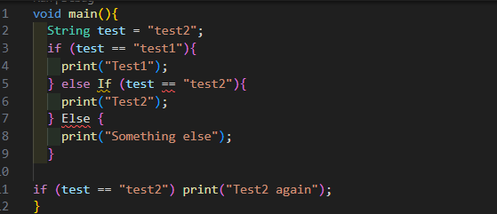 
2. Silakan coba eksekusi (Run) kode pada langkah 1 tersebut. Apa yang terjadi? Jelaskan!
- Output: 
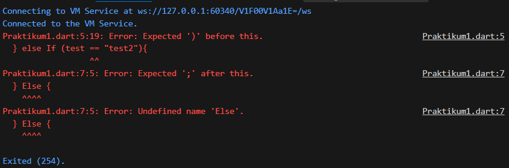
- Penjelasan:  
- Perbaikan: 
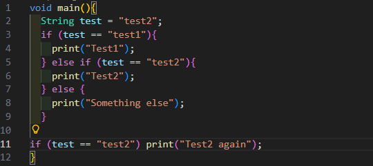
- Output: 
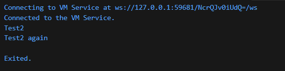
3. Tambahkan kode program berikut, lalu coba eksekusi (Run) kode Anda.
- Tambahan kode:  
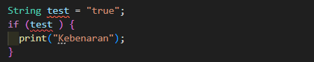 
Apa yang terjadi ? Jika terjadi error, silakan perbaiki namun tetap menggunakan if/else.
- Output: 
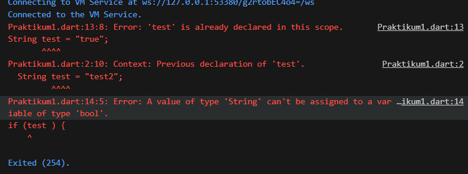
- Penjelasan:  
- Perbaikan: 
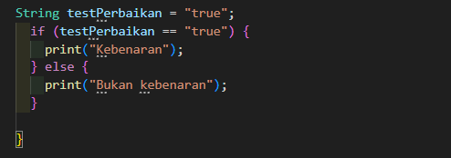
- Output: 
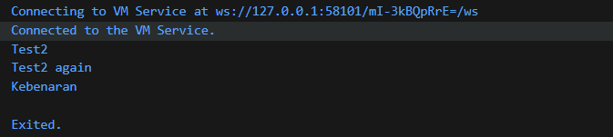

## Tugas Praktikum 2: Menerapkan Perulangan "while" dan "do-while"
1. Ketik atau salin kode program berikut ke dalam fungsi main().
- Hasil kode:  
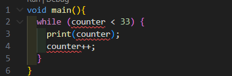 
2. Silakan coba eksekusi (Run) kode pada langkah 1 tersebut. Apa yang terjadi? Jelaskan! Lalu perbaiki jika terjadi error.
- Output: 
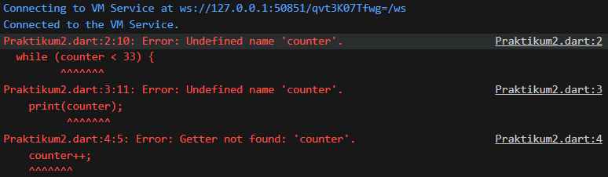
- Penjelasan:  
- Perbaikan: 
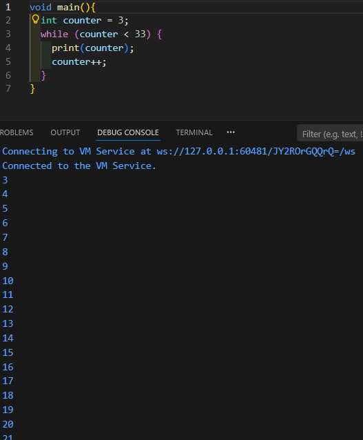
3. Tambahkan kode program berikut, lalu coba eksekusi (Run) kode Anda.
- Tambahan kode:  
 
Apa yang terjadi ? Jika terjadi error, silakan perbaiki namun tetap menggunakan do-while.
- Output: 

- Penjelasan:  
- Perbaikan: 

## Tugas Praktikum 3: Menerapkan Perulangan "for" dan "break-continue"
1. Ketik atau salin kode program berikut ke dalam fungsi main().
- Hasil kode:  
 
2. Silakan coba eksekusi (Run) kode pada langkah 1 tersebut. Apa yang terjadi? Jelaskan! Lalu perbaiki jika terjadi error.
- Output: 

- Penjelasan:  
- Perbaikan: 

3. Tambahkan kode program berikut di dalam for-loop, lalu coba eksekusi (Run) kode Anda.
- Tambahan kode:  
 
Apa yang terjadi ? Jika terjadi error, silakan perbaiki namun tetap menggunakan for dan break-continue.
- Output: 

- Penjelasan:  
- Perbaikan: 
