# Tugas Praktikum 04 Pengantar Bahasa Pemrograman Dart - Bagian 3

Nama    : Azaria Amanda  
NIM     : 244107060060  
Absen   : 05   

## Praktikum 1: Eksperimen Tipe Data List
1. Ketik atau salin kode program berikut ke dalam void main().
- Hasil kode:  
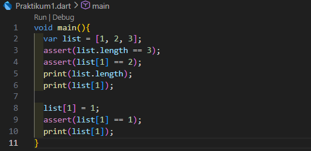 

2. Silakan coba eksekusi (Run) kode pada langkah 1 tersebut. Apa yang terjadi? Jelaskan!
- Output: 
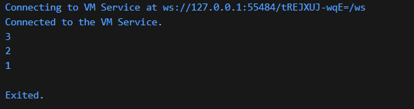
- Penjelasan:  
Program tersebut membuat sebuah list dengan isi [1, 2, 3] yang memiliki panjang list 3. Lalu dilakukan pengecekan menggunakan assert untuk memastikan bahwa panjang list memang 3 dan nilai pada indeks ke-1 adalah 2. Setelah itu, program mencetak panjang list yaitu 3 dan nilai pada indeks ke-1 yaitu 2. Selanjutnya, nilai pada indeks ke-1 diubah dari 2 menjadi 1, lalu dilakukan lagi pengecekan dengan assert untuk memastikan perubahan tersebut berhasil. Terakhir, program mencetak nilai terbaru pada indeks ke-1 yaitu 1.
assert sendiri digunakan untuk memastikan kondisi tertentu sudah sesuai saat program dieksekusi.

3. Ubah kode pada langkah 1 menjadi variabel final yang mempunyai index = 5 dengan default value = null. Isilah nama dan NIM Anda pada elemen index ke-1 dan ke-2. Lalu print dan capture hasilnya.
- Hasil kode:  
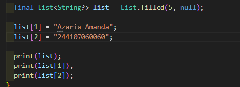 
Apa yang terjadi ? Jika terjadi error, silakan perbaiki.
- Output: 
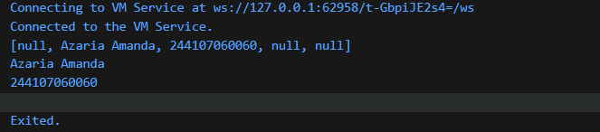
- Penjelasan: 
Program membuat list berisi 5 elemen dengan nilai awal null. Meskipun menggunakan final, isi list tetap bisa diubah, kemudian indeks ke-1 diisi nama dan indeks ke-2 diisi NIM, sementara yang lain tetap null. Output menampilkan seluruh isi list serta nilai pada indeks yang sudah diisi.

## Praktikum 2: Eksperimen Tipe Data Set
1. Ketik atau salin kode program berikut ke dalam void main().
- Hasil kode:  
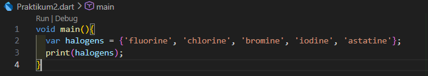 

2. Silakan coba eksekusi (Run) kode pada langkah 1 tersebut. Apa yang terjadi? Jelaskan! Lalu perbaiki jika terjadi error.
- Output: 
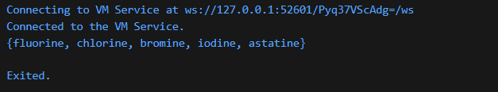
- Penjelasan:  
Program tersebut membuat sebuah Set bernama halogens yang berisi beberapa elemen string yaitu fluorine, chlorine, bromine, iodine, dan astatine. Saat dijalankan, program tidak menghasilkan error dan akan mencetak seluruh isi Set tersebut. Struktur Set ditandai dengan tanda kurung kurawal {} dan memiliki sifat tidak memperbolehkan duplikasi serta tidak menjamin urutan elemen. Output yang ditampilkan menunjukkan semua elemen berhasil disimpan dan ditampilkan dengan benar.

3. Tambahkan kode program berikut, lalu coba eksekusi (Run) kode Anda.
- Hasil kode:  
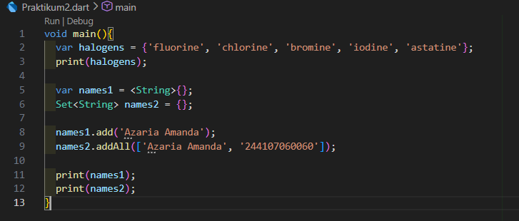 

Apa yang terjadi ? Jika terjadi error, silakan perbaiki namun tetap menggunakan ketiga variabel tersebut. Tambahkan elemen nama dan NIM Anda pada kedua variabel Set tersebut dengan dua fungsi berbeda yaitu .add() dan .addAll().
- Output: 
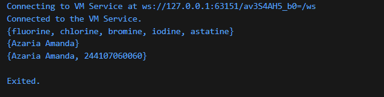
- Penjelasan: 
Program membuat sebuah Set bernama halogens yang berisi beberapa elemen string, kemudian mencetak isinya tanpa terjadi error. Setelah itu dibuat dua Set kosong yaitu names1 dan names2. Pada names1, elemen ditambahkan satu per satu menggunakan fungsi .add() sehingga hanya berisi nama “Azaria Amanda”. Sedangkan pada names2, elemen ditambahkan sekaligus menggunakan fungsi .addAll() sehingga berisi dua data yaitu nama dan NIM. Saat program dijalankan, output menampilkan isi halogens, lalu names1 dengan satu elemen, dan names2 dengan dua elemen. Hal ini menunjukkan bahwa Set dapat diisi dengan cara berbeda dan tidak menyimpan data duplikat serta tidak menjamin urutan elemen.

## Praktikum 3: Eksperimen Tipe Data Set
1. Ketik atau salin kode program berikut ke dalam void main().
- Hasil kode:  
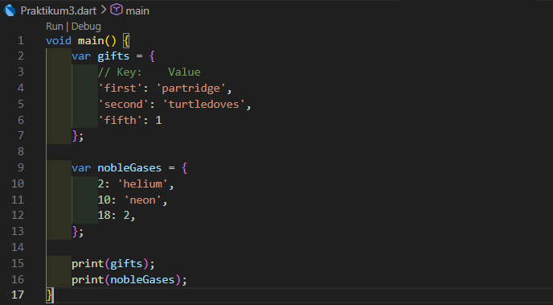 

2. Silakan coba eksekusi (Run) kode pada langkah 1 tersebut. Apa yang terjadi? Jelaskan! Lalu perbaiki jika terjadi error.
- Output: 
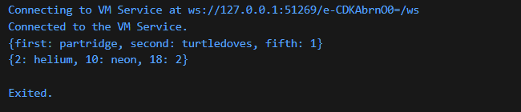
- Penjelasan:  
Kode tersebut berjalan tanpa error dan menampilkan isi dari dua variabel Map, yaitu gifts dan nobleGases. Variabel gifts berisi pasangan key-value dengan key bertipe String dan variabel nobleGases juga merupakan Map, tetapi menggunakan key bertipe int. Dari output yang dihasilkan, dapat diketahui bahwa Map pada Dart digunakan untuk menyimpan data berdasarkan pasangan kunci dan nilai, serta dapat menampung tipe data yang berbeda pada key maupun value.

3. Tambahkan kode program berikut, lalu coba eksekusi (Run) kode Anda.
- Hasil kode:  
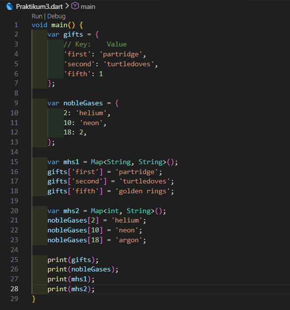 

Apa yang terjadi ? Jika terjadi error, silakan perbaiki namun tetap menggunakan ketiga variabel tersebut.
Tambahkan elemen nama dan NIM Anda pada tiap variabel di atas (gifts, nobleGases, mhs1, dan mhs2). Dokumentasikan hasilnya dan buat laporannya!
- Output: 
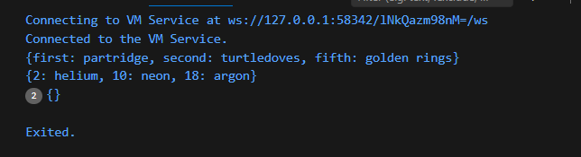
- Penjelasan: 
Saat program dieksekusi, tidak terjadi error, sehingga kode dapat berjalan dengan baik dan menampilkan isi dari empat variabel, yaitu gifts, nobleGases, mhs1, dan mhs2. Pada kode ada beberapa nilai pada gifts dan nobleGases diubah. Variabel gifts dan nobleGases berisi data awal yang telah ditambahkan elemen nama dan NIM, sedangkan mhs1 dan mhs2 berhasil menampilkan data mahasiswa sesuai instruksi.
- Tambahan: 
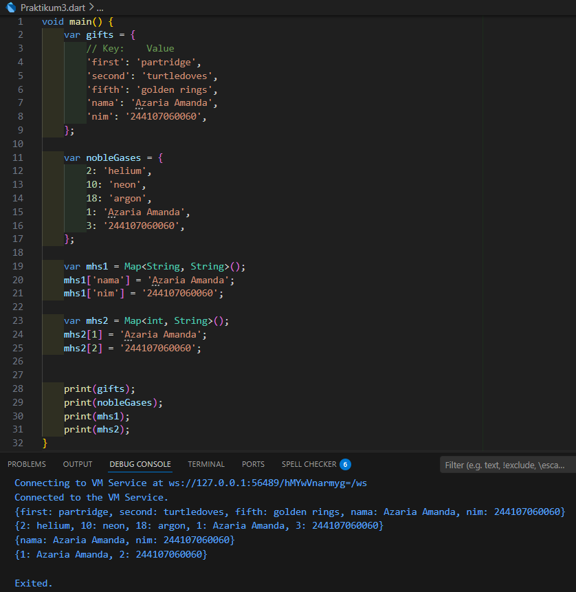

## Praktikum 4: Eksperimen Tipe Data Set
1. Ketik atau salin kode program berikut ke dalam void main().
- Hasil kode:  
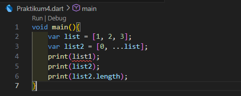 

2. Silakan coba eksekusi (Run) kode pada langkah 1 tersebut. Apa yang terjadi? Jelaskan! Lalu perbaiki jika terjadi error.
- Output: 
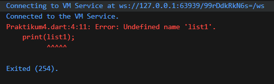
- Penjelasan:  
Kode tersebut mengalami error saat dijalankan karena adanya ketidaksesuaian nama variabel. Pada baris kedua, variabel didefinisikan dengan nama list, namun pada baris keempat, perintah print mencoba memanggil variabel dengan nama list1. Karena list1 belum pernah dibuat atau didefinisikan sebelumnya, program Dart tidak mengenali nama tersebut dan terjadilah error. Untuk memperbaikinya, samakan nama variabel yang dipanggil di dalam fungsi print. Jika variabel awalnya bernama list, maka perintah di baris keempat jg diubah menjadi print(list);
- Perbaikan: 
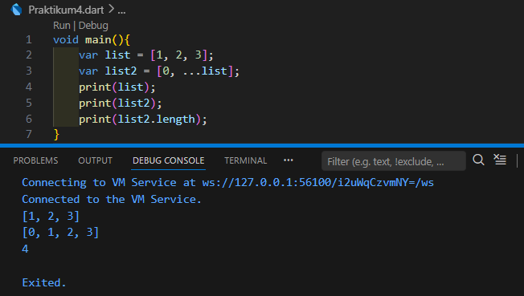

3. Tambahkan kode program berikut, lalu coba eksekusi (Run) kode Anda.
- Hasil kode:  
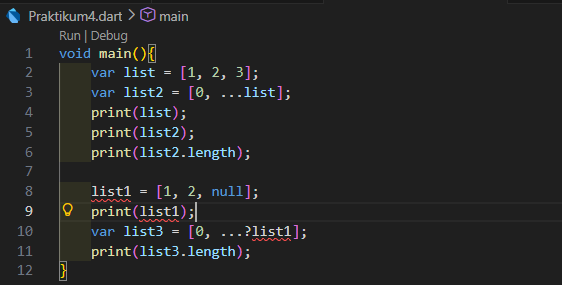 

Apa yang terjadi ? Jika terjadi error, silakan perbaiki.
Tambahkan variabel list berisi NIM Anda menggunakan Spread Operators. Dokumentasikan hasilnya dan buat laporannya!
- Output: 
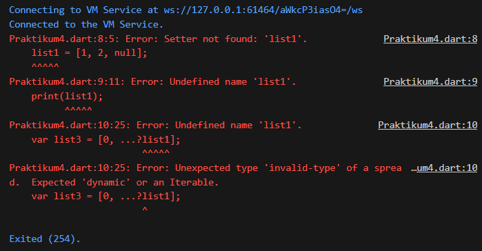
- Penjelasan: 
Kode tersebut mengalami error "Undefined name 'list1'" karena variabel list1 langsung digunakan tanpa dideklarasikan terlebih dahulu menggunakan kata kunci var, final, atau const. Penggunaan Null-aware Spread Operator (...?) pada list3 bertujuan untuk mengantisipasi jika list1 bernilai null, namun karena variabelnya belum dideklarasikan secara benar, program tetap tidak bisa berjalan. Perbaikannya butuh menambahkan kata kunci var sebelum list1
- Perbaikan: 
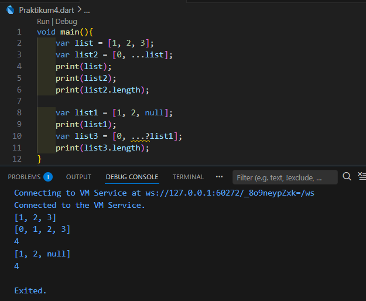
- Tambahan: 
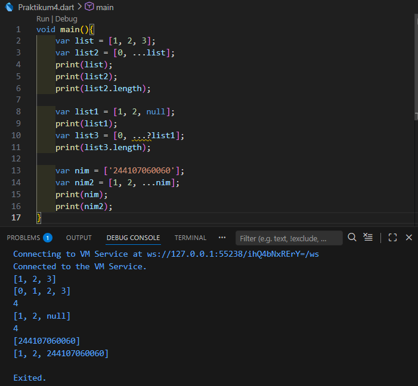

4. Tambahkan kode program berikut, lalu coba eksekusi (Run) kode Anda.
Apa yang terjadi ? Jika terjadi error, silakan perbaiki. Tunjukkan hasilnya jika variabel promoActive ketika true dan false.
- Saat kode dijalankan, akan terjadi error  
Terjadi error "Undefined name 'promoActive'". Hal ini disebabkan karena variabel promoActive digunakan di dalam List nav sebelum variabel tersebut dideklarasikan atau dibuat. Untuk memperbaikinya, harus mendeklarasikan variabel bool promoActive sebelum variabel nav
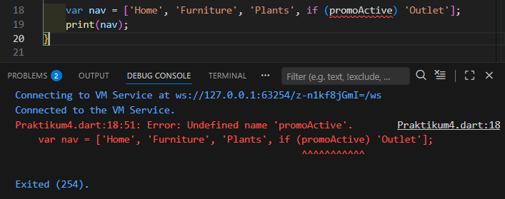
- Jika promoActive = true  
Ketika variabel promoActive disetel ke nilai true, maka kondisi di dalam if pada deklarasi List nav dianggap terpenuhi atau benar, sehingga saat di bagian if (promoActive) program akan menilai bahwa nilainya adalah benar dan 'Outlet' pun ikut dicetak
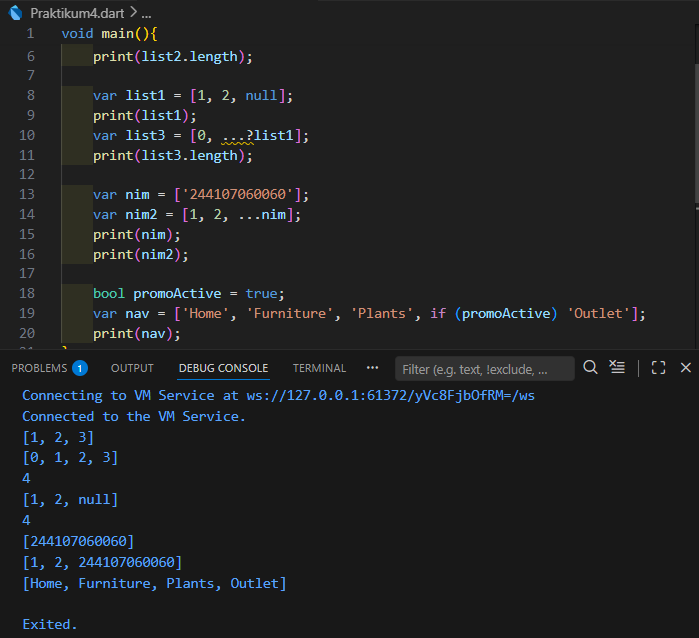
- Jika promoActive = false  
Ketika variabel promoActive disetel ke nilai false, maka kondisi di dalam if pada deklarasi List nav dianggap tidak terpenuhi atau salah, sehingga saat di bagian if (promoActive) program akan menilai bahwa nilainya adalah salah dan 'Outlet' pun dilewati
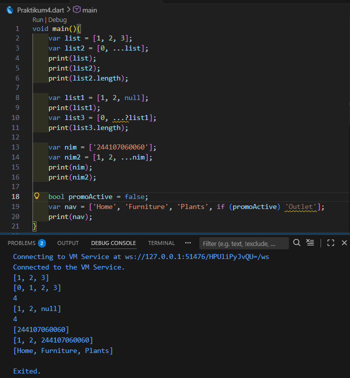

5. Tambahkan kode program berikut, lalu coba eksekusi (Run) kode Anda.
Apa yang terjadi ? Jika terjadi error, silakan perbaiki. Tunjukkan hasilnya jika variabel login mempunyai kondisi lain.
- Saat kode dijalankan, akan terjadi error  
Error "Undefined name 'login'" terjadi karena variabel login dipanggil sebelum dideklarasikan. Agar kode berjalan harus mendefinisikan variabel login terlebih dahulu
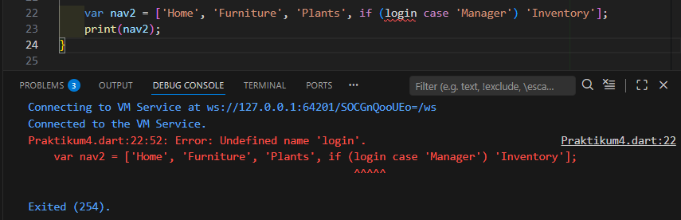
- Jika variabel login mempunyai kondisi manager  
Variabel login berisi teks yang tepat sama dengan syarat yang diminta, yaitu 'Manager' sehingga program mengevaluasi if (login case 'Manager') dan karena isinya cocok, maka syarat dianggap Benar (True) dan 'Inventory' akan ditambahkan dan dicetak ke dalam List
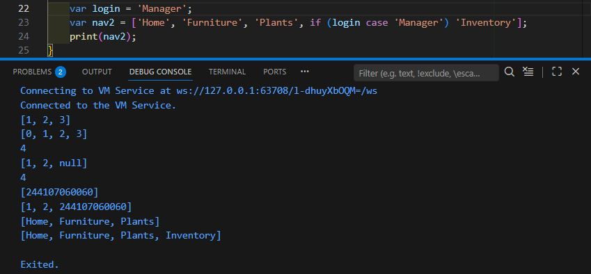
- Jika variabel login mempunyai kondisi user  
Variabel login berisi teks 'User', 'Staff', atau teks lainnya yang bukan 'Manager' maka program akan mengevaluasi if (login case 'Manager') dan karena isinya tidak cocok, maka syarat dianggap Salah (False) dan 'Inventory' akan diabaikan dan tidak dimasukkan ke dalam List
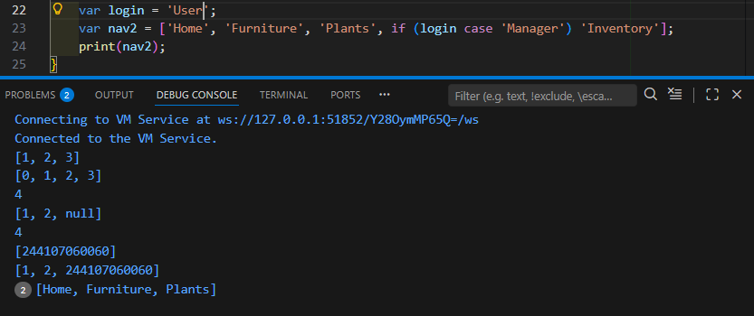

6. Tambahkan kode program berikut, lalu coba eksekusi (Run) kode Anda. Apa yang terjadi ? Jika terjadi error, silakan perbaiki. Jelaskan manfaat Collection For dan dokumentasikan hasilnya.
- Output: 
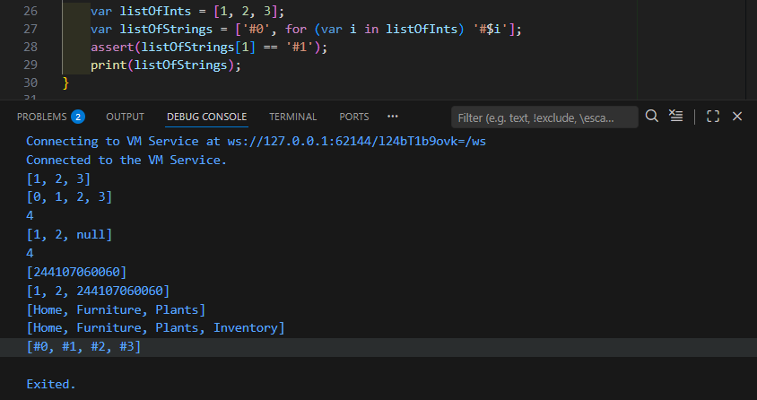
- Penjelasan: 
Kode tersebut berjalan tanpa ada error, berhasil mengubah sebuah daftar angka menjadi daftar teks dengan format tertentu menggunakan perulangan di dalam pembuatan List.   
Manfaat Collection For
1. Ringkas dan Efisien jadi tidak perlu membuat List kosong lalu menggunakan .add() berulang kali di baris kode yang terpisah. Semuanya dilakukan langsung di dalam tanda kurung siku []
2. Sangat berguna untuk mengubah format data
3. Logika pembentukan List terlihat lebih jelas dan deklaratif, sehingga pengembang lain bisa langsung paham bahwa listOfStrings adalah turunan dari listOfInts

## Praktikum 5: Eksperimen Tipe Data Records
1. Ketik atau salin kode program berikut ke dalam void main().
- Hasil kode:  
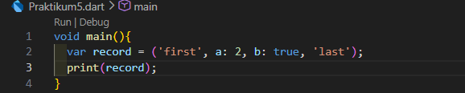 

2. Silakan coba eksekusi (Run) kode pada langkah 1 tersebut. Apa yang terjadi? Jelaskan! Lalu perbaiki jika terjadi error.
- Output: 
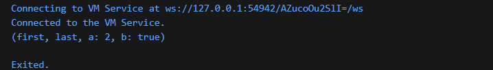
- Penjelasan:  
Tidak terjadi error, kode menunjukkan penggunaan tipe data Records, yaitu kumpulan objek yang bersifat immutable (tidak dapat diubah) dan memiliki ukuran tetap. Ketika program dijalankan, variabel record menyimpan campuran nilai berupa teks (positional fields) dan nilai yang diberi label seperti a: 2 (named fields). Hasil output menampilkan (first, last, a: 2, b: true), yang membuktikan bahwa Dart secara otomatis mengelompokkan elemen posisi di depan dan elemen bernama di bagian belakang saat dicetak

3. Tambahkan kode program berikut di dalam scope void main(), lalu coba eksekusi (Run) kode Anda.
- Hasil kode:  
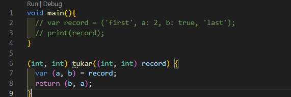 

Apa yang terjadi ? Jika terjadi error, silakan perbaiki. Gunakan fungsi tukar() di dalam main() sehingga tampak jelas proses pertukaran value field di dalam Records.
- Output: 
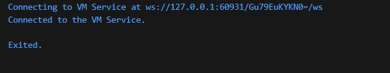
- Penjelasan: 
Saat pertama di run hasilnya kosong lalu setelah ditambahkan code pada main dapat dilihat bahwa fungsi tukar menerima input berupa pasangan angka (int, int) dan melakukan proses destrukturisasi untuk menukar posisi nilai tersebut. Hasil perbaikan menunjukkan bahwa saat data (10, 20) dimasukkan, fungsi berhasil mengembalikan (20, 10). Ini membuktikan bahwa Records mempermudah proses pertukaran data tanpa memerlukan variabel sementara yang kompleks.
- Perbaikan: 
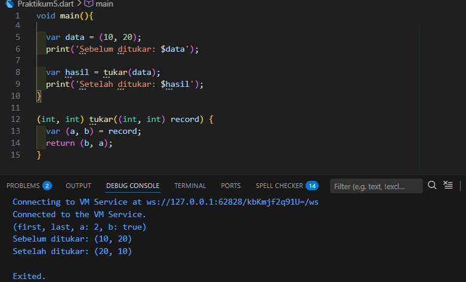

4. Tambahkan kode program berikut di dalam scope void main(), lalu coba eksekusi (Run) kode Anda. Apa yang terjadi ? Jika terjadi error, silakan perbaiki. Inisialisasi field nama dan NIM Anda pada variabel record mahasiswa di atas. Dokumentasikan hasilnya dan buat laporannya!
- Hasil:  
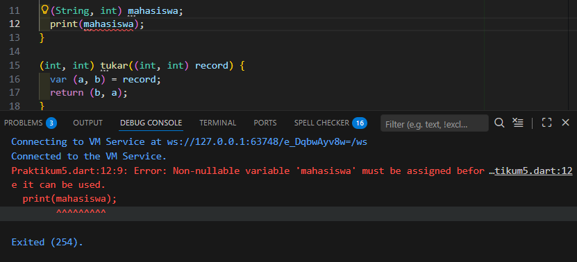 
- Perbaikan: 
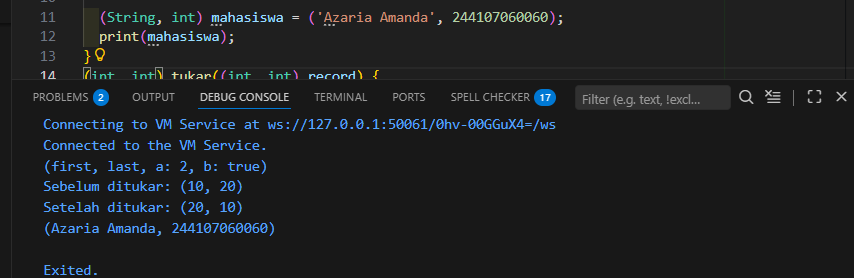
- Penjelasan: 
Terjadi error "Non-nullable variable must be assigned before it can be used" karena variabel mahasiswa sudah dipanggil untuk dicetak sebelum memiliki isi. Setelah diperbaiki dengan memberikan nilai inisialisasi berupa nama 'Azaria Amanda' dan NIM '244107060060', program dapat berjalan normal. Records berfungsi sebagai wadah informasi yang menggabungkan tipe data String dan int dalam satu baris deklarasi yang ringkas.

5. Tambahkan kode program berikut di dalam scope void main(), lalu coba eksekusi (Run) kode Anda. Apa yang terjadi ? Jika terjadi error, silakan perbaiki. 
- Hasil:  
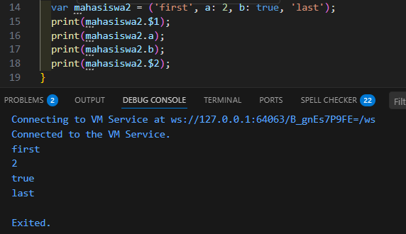 
- Penjelasan: 
Untuk elemen posisi (positional fields), akses dilakukan menggunakan sintaks $1, $2, dan seterusnya, sementara untuk elemen bernama (named fields), akses dilakukan langsung melalui nama labelnya seperti .a atau .b. Dengan memodifikasi isinya menggunakan identitas diri, program berhasil mencetak data nama dan NIM secara spesifik berdasarkan indeks dan label yang ditentukan

Gantilah salah satu isi record dengan nama dan NIM Anda, lalu dokumentasikan hasilnya dan buat laporannya!
- Modifikasi: 
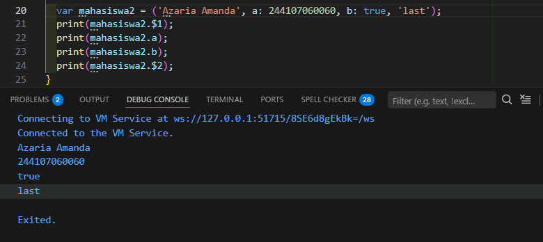

## Tugas Praktikum
1. Silakan selesaikan Praktikum 1 sampai 5, lalu dokumentasikan berupa screenshot hasil pekerjaan Anda beserta penjelasannya!
2. Jelaskan yang dimaksud Functions dalam bahasa Dart!
- Jawab:  
Function dalam bahasa Dart adalah kode yang digunakan untuk menjalankan tugas tertentu dan dapat dipanggil berulang kali tanpa harus menulis ulang kode yang sama yang membantu program menjadi lebih terstruktur, rapi, mudah dibaca. Function dapat memiliki parameter sebagai input dan juga dapat mengembalikan nilai (return value) sebagai output.
3. Jelaskan jenis-jenis parameter di Functions beserta contoh sintaksnya!
- Jawab:  
a. Required Positional Parameter: Parameter yang wajib diisi sesuai urutan saat function dipanggil.
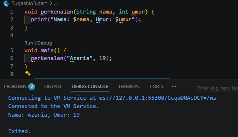 
b. Optional Positional Parameter: Parameter bersifat opsional dan ditulis di dalam tanda kurung siku [].
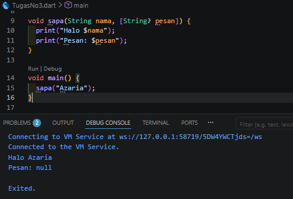 
c. Named Parameter: Parameter yang dipanggil berdasarkan nama parameternya dan ditulis di dalam kurung kurawal {}
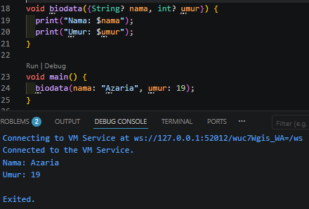 
d. Default parameter value: Parameter yang memiliki nilai bawaan (default) jika saat function dipanggil parameter tersebut tidak diisi.
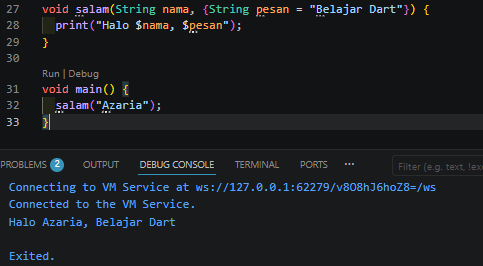 
4. Jelaskan maksud Functions sebagai first-class objects beserta contoh sintaknya!
- Jawab:  
function merupakan first-class object, artinya function diperlakukan seperti objek atau nilai biasa. Function dapat disimpan ke dalam variabel, dikirim sebagai parameter ke function lain, dan dikembalikan dari function lain. Pada contoh di bawah, function salam disimpan ke variabel fungsiSaya, lalu dipanggil seperti function biasa.
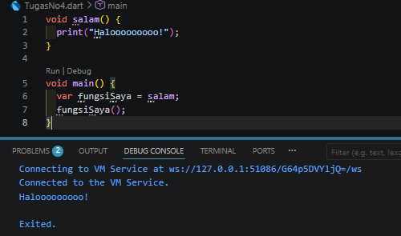 
5. Apa itu Anonymous Functions? Jelaskan dan berikan contohnya!
- Jawab:  
Anonymous Function adalah function tanpa nama. Function ini biasanya digunakan ketika function hanya dipakai sekali atau langsung digunakan pada suatu proses tertentu. Anonymous function sering dipakai dalam list, callback, atau operasi singkat lainnya.
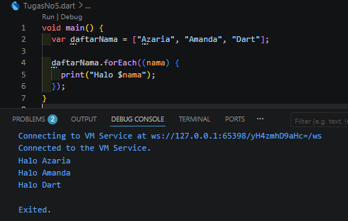 
6. Jelaskan perbedaan Lexical scope dan Lexical closures! Berikan contohnya!
- Jawab:  
a. Lexical Scope: sebuah variabel hanya dapat diakses di dalam ruang lingkup (scope) tempat variabel tersebut dideklarasikan. Function di dalam function dapat mengakses variabel dari function luar. Pada contoh, function tampilNama() dapat mengakses variabel nama karena berada dalam scope yang sama atau lebih luar.  
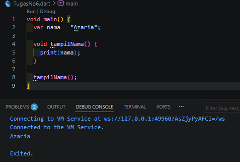 
b. Lexical Closures: function yang menyimpan akses ke variabel dari scope luar, meskipun function luar tersebut sudah selesai dijalankan. Pada contoh, function yang dikembalikan masih bisa mengakses variabel angka, walaupun function hitung() sudah selesai dijalankan.
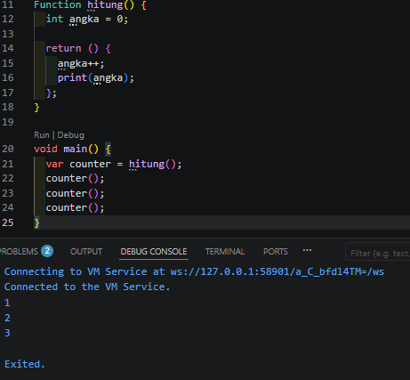 
7. Jelaskan dengan contoh cara membuat return multiple value di Functions!
- Jawab:  
Secara umum, sebuah function hanya mengembalikan satu nilai. Namun di Dart, bisa membuat function seolah-olah mengembalikan lebih dari satu nilai dengan beberapa cara, misalnya menggunakan List, Map, atau Object.
a. Menggunakan List
Beberapa nilai dimasukkan ke dalam satu list, lalu function mengembalikan list tersebut. Nilai-nilai di dalam list diakses berdasarkan index, misalnya index 0 untuk data pertama dan index 1 untuk data kedua. Function getData() mengembalikan dua data dalam bentuk list, yaitu nama dan NIM. Nilai tersebut kemudian disimpan ke variabel data dan diakses menggunakan index.
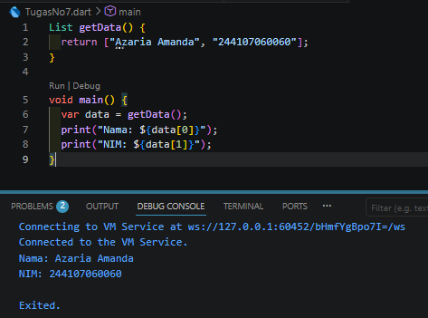 
b. Menggunakan Map
Data dikembalikan dalam bentuk pasangan key-value, sehingga setiap nilai memiliki nama kunci masing-masing. Cara ini lebih mudah dipahami karena data dapat diakses menggunakan nama key, bukan index. Function getMahasiswa() mengembalikan data dalam bentuk Map dengan key "nama" dan "nim"
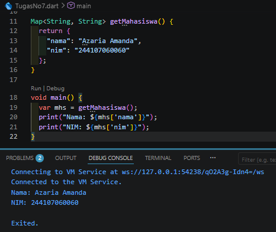 
c. Menggunakan Record
Record memungkinkan beberapa data dikembalikan sekaligus tanpa harus membuat class, list, atau map terlebih dahulu. Function getBiodata() mengembalikan dua nilai sekaligus dalam bentuk Record, yaitu nama dan NIM. Nilai tersebut dapat diakses menggunakan $1, $2, dan seterusnya sesuai urutan data.
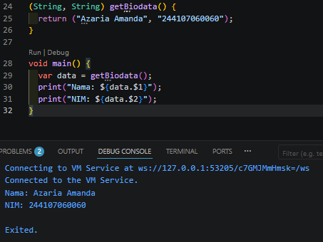 