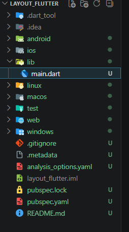
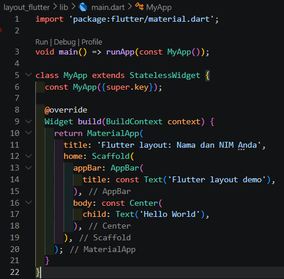
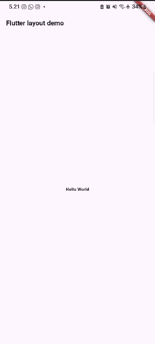
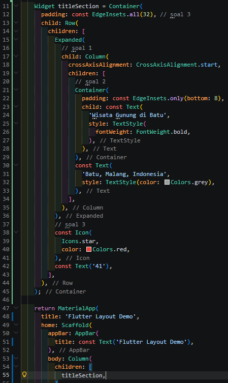

# Laporan Praktikum 06 : Layout dan Navigasi

Nama    : Azaria Amanda  
NIM     : 244107060060  
Absen   : 05  

## Praktikum 1: Membangun Layout di Flutter
1. Langkah 1: Buat Project Baru 
 

2. Langkah 2: Buka file lib/main.dart 
 
 

3. Langkah 3: Identifikasi layout diagram  

4. Langkah 4: Implementasi title row 
 
 
